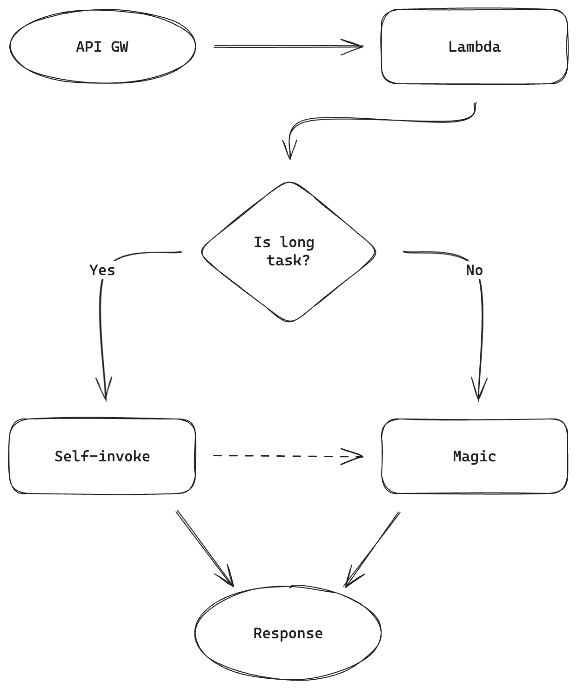

AWS Lambda can run up to 15 minutes. Then it turns off. 15 minutes. It will be enough. I’ll throw a request to API Gateway and... Yeah. API GW has it own limits. 30 seconds and you’re done.

I’ll try to show you one of possible solutions to overcome that limit.

> [!info]
> If you’re not interested in the steps of the whole process there is ready solution at the end of this post.

# Basic request

How does the Lambda + API GW flow look like?

1. API GW gets a request
2. API GW calls Lambda
3. \<magic\>
4. Lambda returns a response which is forwarded, by API GW, to the caller


```ts
import { APIGatewayProxyEventV2, Context, Handler } from 'aws-lambda';

const entrypoint: Handler<APIGatewayProxyEventV2, { statusCode: number }> = async (
  event,
  context,
  callback,
) => {
  // \<magic\>
  
  return { statusCode: 200 };
};

export default entrypoint;
```

Things start to complicate a bit once_\<magic\>_takes more than 30 seconds. 5xx response code, process terminated, not much in logs. What’s worse, if you try to run the process locally everything’s fine. Source of this issue is max integration time in API Gateway.

Tricks like running a long process asynchronously and early response are useless. The process dies the moment response is sent.

# Self-invoke to the rescue

There are several ways to work around this problem. You can push a message to SQS, run a separate lambda to process data or use EC2 instead of API GW. But there’s one more solution, which works flawlessly with small functions. “Self-invoking” lambda. The process is similar to the basic one:

1. API GW gets a request
2. API GW calls Lambda
3. \<magic\>
4. Lambda returns a response which is forwarded, by API GW, to the caller

Ok, it’s identical, but _\<magic\>_ starts with conditional statement (we’ll just throw an `if` at it).

Cons? Status code~~may~~will lie. API GW will return 202 instead of 200 and magic will happen behind the scenes.



## Step by step

### Permissions to self-invoke

Let’s assume our lambda’s called `devnotes-demo-lambda`. We have to assign correct permissions to it. The following code fragment allows to call `devnotes-demo-lambda` from its own process:

```json
{
  "Statement": [
    {
      "Action": ["lambda:InvokeFunction"],
      "Effect": "Allow",
      "Resource": [
        "arn:aws:lambda:*:*:function:devnotes-demo-lambda"
      ]
    }
  ],
  "Version": "2012-10-17"
}
```

### Custom event support

We can write some code now. Let’s start with new event definition:

```ts
type CustomEvent = { eventType: 'DevNotesCustomEvent' };
type HandlerEvent = APIGatewayProxyEventV2 | CustomEvent;
```

We might need a helper to detect that event too:

```ts
const isCustomEvent = (event: HandlerEvent): event is CustomEvent =>
  'eventType' in event && event?.eventType === 'DevNotesCustomEvent';
```

Now cosmetic changes in the `entrypoint`. We have to switch event type to add support for `CustomEvent` type. This way a single handler can work with 2 different events:

```ts
const entrypoint: Handler<HandlerEvent, { statusCode: number }> = async (
  event,
  context,
  callback,
) => {
  if (isCustomEvent(event)) {
    // handle custom event
    return { statusCode: 202 };
  }

  // handle api event
  return { statusCode: 200 };
};
```

### Call the lambda

But that’s not all. We have to call the lambda function somehow - this is the part that solves the timeout issue. Here’s the trigger:

```ts
const triggerCustomEventFromApi = async (context: Context) => {
  const client = new LambdaClient({
    region: process.env?.AWS_REGION || '...',
  });

  await client.send(
    new InvokeCommand({
      FunctionName: context.functionName,
      Payload: JSON.stringify({
        eventType: 'DevNotesCustomEvent',
      }),
      LogType: 'None',
      InvocationType: 'Event',
    }),
  );
};
```

What’s going on in here? We create an instance of `LambdaClient`. The `AWS_REGION` env variable is set by AWS. Then, using current function’s name (`FunctionName: context.functionName`) we self-invoke the lambda. Thanks to that this piece of code will work no matter the region or function’s name.

### API call support

The trigger it ready, now it’s time to add API call support. Every time our function receives a request on `/triggerCustomEvent` path, we’ll pull the trigger and respond with a `202 Accepted` status code. Any other route can be handled separately.

```ts
const handleApiEvent: Handler = async (
  event,
  context,
  callback
) => {
  if (event.rawPath === '/triggerCustomEvent') {
    await triggerCustomEventFromApi(context);

    return { statusCode: 202 };
  }

  // other routes' \<magic\>

  // no route matched? 404!
  return { statusCode: 404 };
};
```

## Full implementation

A few code changes later our implementation looks more or less like below. First of all, Lambda permissions:

```json
{
  "Statement": [
    {
      "Action": ["lambda:InvokeFunction"],
      "Effect": "Allow",
      "Resource": [
        "arn:aws:lambda:*:*:function:devnotes-demo-lambda"
      ]
    }
  ],
  "Version": "2012-10-17"
}
```

Permissions are there, now the code:

```ts
import { APIGatewayProxyEventV2, Context, Handler } from 'aws-lambda';
import { InvokeCommand, LambdaClient } from '@aws-sdk/client-lambda';

type CustomEvent = { eventType: 'DevNotesCustomEvent' };
type HandlerEvent = APIGatewayProxyEventV2 | CustomEvent;

const isCustomEvent = (event: HandlerEvent): event is CustomEvent =>
  'eventType' in event && event?.eventType === 'DevNotesCustomEvent';

const triggerCustomEventFromApi = async (context: Context) => {
  const client = new LambdaClient({
    region: process.env?.AWS_REGION || '...',
  });

  await client.send(
    new InvokeCommand({
      FunctionName: context.functionName,
      Payload: JSON.stringify({
        eventType: 'DevNotesCustomEvent',
      }),
      LogType: 'None',
      InvocationType: 'Event',
    }),
  );
};

const handleApiEvent: Handler = async (event, context, callback) => {
  if (event.rawPath === '/triggerCustomEvent') {
    await triggerCustomEventFromApi(context);

    return { statusCode: 202 };
  }

  // other routes' <magic>

  // no route matched? 404!
  return { statusCode: 404 };
};

const handleCustomEvent: Handler = async (event, context, callback) => {
  // <magic>

  return { statusCode: 200 };
};

const entrypoint: Handler<HandlerEvent, { statusCode: number }> = async (
  event,
  context,
  callback,
) => {
  if (isCustomEvent(event)) {
    return handleCustomEvent(event, context, callback);
  }

  return handleApiEvent(event, context, callback);
};

export default entrypoint;
```

# Summary

As I said, this solution is useful when we’re working with pretty small Lambdas. It will also be sufficient when only one of few endpoints requires the long-running action. It’s convenient because whole code lives in one place.

The biggest con seems to be the lying response data. If you really need it you have to search through the logs. Of course nothing stops you to submit the result to Slack or save it in DynamoDB.

If I had to implement more than a few processes like that I’d rather look at separate lambdas for each of them and single API GW as a proxy.
