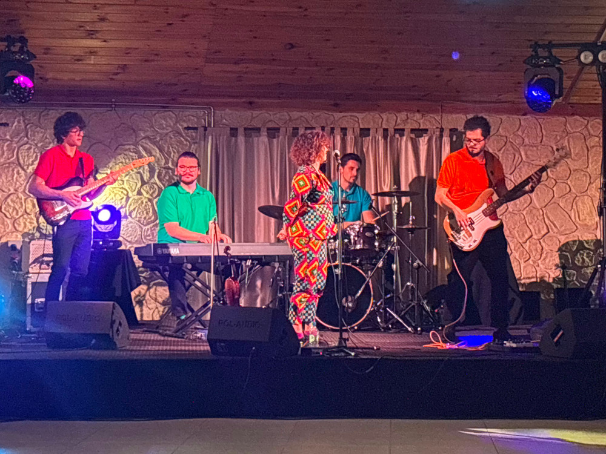

---  
title: PHPCon 2023 moim okiem
date: 2023-11-23
tags: [php, phpcon]
categories: [konferencje]
image: ./phpcon23.jpg
draft: true
summary: >-
    Miałem przyjemność uczestniczyć w kolejnej edycji PHPCon. Kilka słów o organizacji, warsztatach i prelekcjach. 
---

[PHPCon Poland](https://phpcon.pl "https://phpcon.pl"). Najstarsza i jedna z największych konferencji dla PHPowców w Polsce. Pod koniec listopada ponownie spotkaliśmy się w Villa Verde Congress & SPA w Zawierciu. Mieliśmy okazję posłuchać o architekturze oprogramowania, DDD, podejściu do testowania i wielu innych tematach związanych z PHP i nie tylko.

# Warsztaty i prelekcje

- **Domain Driven Design w praktyce** (Michał Giergielewicz - [@giergielewicz](https://twitter.com/giergielewicz "https://twitter.com/giergielewicz")) - warsztat z  projektowania architektury z użyciem DDD. Wykorzystując mob programming, dyskusje i wykrzykiwanie nazw obiektów udało się stworzyć zalążek aplikacji wspomagającej codzienną pracę programistów. Dużym plusem było to, że nie tworzyliśmy kolejnego prostego koszyka zakupowego czy innego CMS, a aplikację która rozwiązywała realny problem.
- **Context Maps - kto? z kim? i dlaczego** (Adam Kasperczak) - pozostając w temacie DDD, omówienie możliwych sposobów komunikacji między bounded contextami. Kto i na jakich zasadach może odwoływać się do innych części aplikacji.
- **Jak (nie) osiwieć debugując** (Przemysław Pawliczuk - [@er1z](https://twitter.com/er1z "https://twitter.com/er1z")) - kilka słów o tym jak każdy z nas zaczynał swoją przygodę z debugowaniem (spoiler `var_dump(’dupa’);` ). Kilka słów o tym, że nie jesteś jedyną osobą, która spędza 3 dni na szukaniu błędu, a poprawka sprowadza się do zmiany 1 linii. Kilka słów o tym, jak zamiast starego dobrego `var_dump`  płynnie przejść do XDebug.
- **Potęga prostego kodu - wartość w niepozornym obiekcie** (Mariusz Gil - [@mariuszgil](https://twitter.com/mariuszgil "https://twitter.com/mariuszgil")) - chyba najbardziej wyczekiwany prelegent całej konferencji. Niby DDD, ale tak nie do końca. Omówienie i prezentacja wzorca _value object_ na przykładzie startu rakiety SpaceX. O tym, jak łatwe jest wdrożenie tego wzorca w swoich projektach, aby kod był bardziej czytelny i testowalny.

Na stronie wydarzenia [Joind.in PHPCon 2023](https://joind.in/event/phpcon-poland-2023 "https://joind.in/event/phpcon-poland-2023") można ocenić i skomentować prelekcje. Serdecznie do tego zachęcam. Oceny i komentarze pomagają prelegentom lepiej przygotowywać się w przyszłości. Organizatorzy również mogą posiłkować się ocenami przy wyborze tematów na inne eventy.

Drugiego dnia, jedna z hotelowych sal została przeznaczona na Unconference, czyli krótkie prelekcje prowadzone przez uczestników konferencji.

# Integracja

Jednego dnia mecz Polska - Czechy, ping pong i kręgle, drugiego darmowe jedzenie, piwo i koncert grupy [Kołdra](https://www.youtube.com/@koldrateam "https://www.youtube.com/@koldrateam"). Do tego hotelowa strefa SPA dostępna przez cały czas trwania konferencji Organizatorzy zadbali o to, żebyśmy mogli się lepiej poznać i wymienić opiniami na temat prelekcji.

# Podsumowanie

Jak co roku organizatorzy stanęli na wysokości zadania. Wszystkie strefy i sale zostały dobrze oznakowane, nie było problemu, żeby gdziekolwiek trafić. Prelekcje i warsztaty stały na wysokim poziomie. Ciesze się, że - mimo tego, że wiele osób twierdzi, że _PHP umiera_ - PHPCon cieszy się ogromnym zainteresowaniem.

Do zobaczenia w przyszłym roku!
