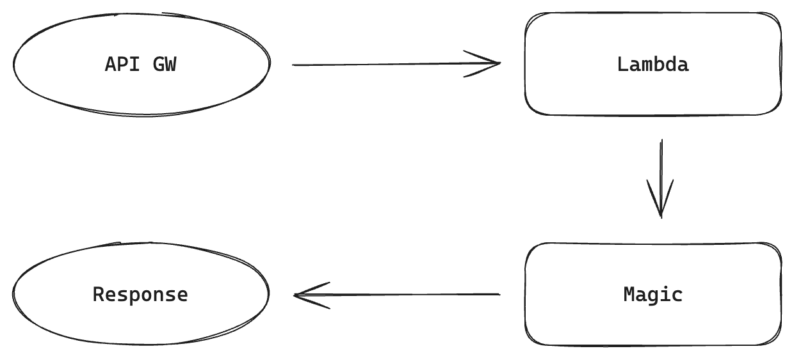
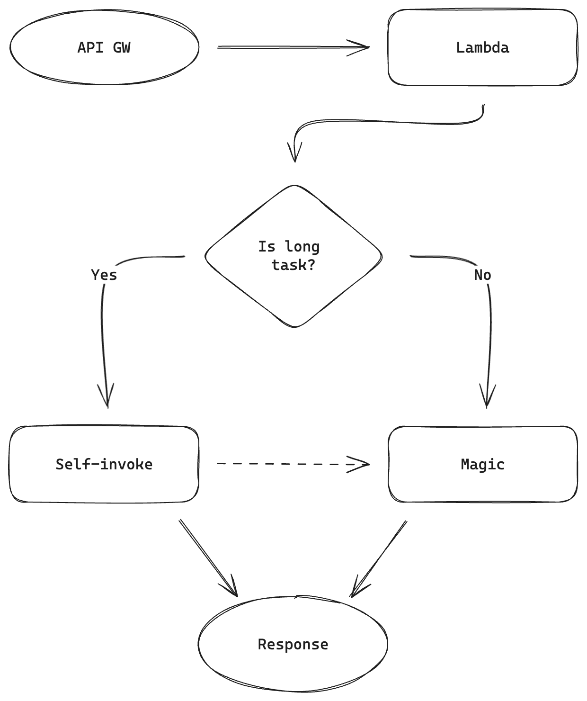

Lambda w AWS może pracować do 15 minut. Po tym czasie się wyłącza. 15 minut. Przecież mi wystarczy. Puszczę request na API Gateway i... No właśnie. API GW ma swoje nieprzekraczalne limity. 30 sekund i koniec.

Poniżej postaram się zaprezentować jeden ze sposobów obejścia powyższego problemu.

> [!info] 
> Jeżeli nie interesuje cię droga do problemu, a samo rozwiązanie, to na końcu wpisu jest gotowiec

# Podstawowy request

Jak wygląda procesowanie danych w lambdzie z API GW?

1. API GW dostaje request
2. API GW wywołuje Lambdę
3. \<magic\>
4. Lambda zwraca response, a API GW przekierowuje wynik do użytkownika



```ts
import { APIGatewayProxyEventV2, Context, Handler } from 'aws-lambda';

const entrypoint: Handler<APIGatewayProxyEventV2, { statusCode: number }> = async (
  event,
  context,
  callback,
) => {
  // <magic>
  
  return { statusCode: 200 };
};

export default entrypoint;
```

Schody zaczynają się, gdy _\<magic\>_ trwa dłużej niż 30 sekund. Response 5xx, proces przerwany, w logach też za dużo się nie dzieje. Co gorsze, uruchomienie procesu lokalnie działa bez zarzutu. Źródłem problemu jest maksymalny czas zapytania do API Gateway.

Na nic sztuczki w postaci uruchomienia długiego procesu asynchronicznie i wczesny response. Proces umiera z chwilą wysłania odpowiedzi.

# Self-invoke na ratunek

Jest kilka możliwości obejścia tego problemu. Puszczenie wiadomości na SQS, dodatkowa lambda, która wykona zadanie, EC2 zamiast API GW. Ale jest jeszcze jedno rozwiązanie, które idealnie nadaje się do małych funkcji. “Samo-wywołanie” lambdy. Proces jest podobny do bazowego:

1. API GW dostaje request
2. API GW wywołuje Lambdę
3. \<magic\>
4. Lambda zwraca response, a API GW przekierowuje wynik do użytkownika

Dobra, proces jest identyczny, ale _\<magic\>_ zaczyna się od warunku (to się `if`em zaklei).

Minusy takiego rozwiązania? Status-code ~~może~~ będzie kłamać. API GW zwróci 202 zamiast 200, a magia stanie się w tle.



## Krok po kroku

### Uprawnienia do wywołania samej siebie

Załóżmy, że nasza lambda nazywa się `devnotes-demo-lambda`. Trzeba teraz ustawić na niej odpowiednie uprawnienia. Poniższy fragment kodu zezwala na wywołanie `devnotes-demo-lambda` z procesu lambdy.

```json
{
  "Statement": [
    {
      "Action": ["lambda:InvokeFunction"],
      "Effect": "Allow",
      "Resource": [
        "arn:aws:lambda:*:*:function:devnotes-demo-lambda"
      ]
    }
  ],
  "Version": "2012-10-17"
}
```

### Obsługa niestandardowego eventu

Możemy już przejść do kodu. Zacznijmy od zdefiniowania nowego eventu:

```ts
type CustomEvent = { eventType: 'DevNotesCustomEvent' };
type HandlerEvent = APIGatewayProxyEventV2 | CustomEvent;
```

To tego dorzucamy helper, który pozwala wykryć niestandardowe zdarzenia:

```ts
const isCustomEvent = (event: HandlerEvent): event is CustomEvent =>
  'eventType' in event && event?.eventType === 'DevNotesCustomEvent';
```

Teraz kosmetyczne zmiany w `entrypoint`. Zmieniamy typ eventu i dodajemy obsługę `CustomEvent`. W ten sposób, 1 handler jest w stanie obsłużyć 2 różne eventy:

```ts
const entrypoint: Handler<HandlerEvent, { statusCode: number }> = async (
  event,
  context,
  callback,
) => {
  if (isCustomEvent(event)) {
    // handle custom event
    return { statusCode: 202 };
  }

  // handle api event
  return { statusCode: 200 };
};
```

### Wywołanie lambdy

Dobrze, ale to nie koniec zmian. Czas na wywołanie lambdy, czyli to, co rozwiązuje problem timeoutów. Najpierw trigger.

```ts
const triggerCustomEventFromApi = async (context: Context) => {
  const client = new LambdaClient({
    region: process.env?.AWS_REGION || '...',
  });

  await client.send(
    new InvokeCommand({
      FunctionName: context.functionName,
      Payload: JSON.stringify({
        eventType: 'DevNotesCustomEvent',
      }),
      LogType: 'None',
      InvocationType: 'Event',
    }),
  );
};
```

Co tu się dzieje? Tworzymy klienta `LambdaClient`. Zmienna środowiskowa `AWS_REGION` jest ustawiana przez AWS. Następnie wywołujemy lambdę pobierając jej nazwę z kontekstu: `FunctionName: context.functionName`. Dzięki temu, niezależnie od regionu czy nazwy funkcji, wywołanie zadziała.

### Obsługa z poziomu API

Skoro mamy trigger, czas na obsługę z poziomu API. Gdy otrzymamy request ze ścieżką `/triggerCustomEvent` , uruchamiamy trigger i zwracamy status `202 Accepted`. Każda inna ścieżka może być obsłużona niezależnie.

```ts
const handleApiEvent: Handler = async (
  event,
  context,
  callback
) => {
  if (event.rawPath === '/triggerCustomEvent') {
    await triggerCustomEventFromApi(context);

    return { statusCode: 202 };
  }

  // other routes <magic>

  // no route matched? 404!
  return { statusCode: 404 };
};
```

## Pełna implementacja

Kilka funkcji później nasza implementacja wygląda jak poniżej. Najpierw konfiguracja uprawnień:

```json
{
  "Statement": [
    {
      "Action": ["lambda:InvokeFunction"],
      "Effect": "Allow",
      "Resource": [
        "arn:aws:lambda:*:*:function:devnotes-demo-lambda"
      ]
    }
  ],
  "Version": "2012-10-17"
}
```

Mają uprawnienia, można aktualizować kod:

```ts
import { APIGatewayProxyEventV2, Context, Handler } from 'aws-lambda';
import { InvokeCommand, LambdaClient } from '@aws-sdk/client-lambda';

type CustomEvent = { eventType: 'DevNotesCustomEvent' };
type HandlerEvent = APIGatewayProxyEventV2 | CustomEvent;

const isCustomEvent = (event: HandlerEvent): event is CustomEvent =>
  'eventType' in event && event?.eventType === 'DevNotesCustomEvent';

const triggerCustomEventFromApi = async (context: Context) => {
  const client = new LambdaClient({
    region: process.env?.AWS_REGION || '...',
  });

  await client.send(
    new InvokeCommand({
      FunctionName: context.functionName,
      Payload: JSON.stringify({
        eventType: 'DevNotesCustomEvent',
      }),
      LogType: 'None',
      InvocationType: 'Event',
    }),
  );
};

const handleApiEvent: Handler = async (event, context, callback) => {
  if (event.rawPath === '/triggerCustomEvent') {
    await triggerCustomEventFromApi(context);

    return { statusCode: 202 };
  }

  // other routes' <magic>

  // no route matched? 404!
  return { statusCode: 404 };
};

const handleCustomEvent: Handler = async (event, context, callback) => {
  // <magic>

  return { statusCode: 200 };
};

const entrypoint: Handler<HandlerEvent, { statusCode: number }> = async (
  event,
  context,
  callback,
) => {
  if (isCustomEvent(event)) {
    return handleCustomEvent(event, context, callback);
  }

  return handleApiEvent(event, context, callback);
};

export default entrypoint;
```

# Podsumowanie

Jak już wspomniałem, takie rozwiązanie jest przydatne przy małych lambdach. Nada się również, gdy tylko jeden z kilku endpointów wymaga dłuższego procesowania. Jest to o tyle wygodne, że cały kod żyje w jednym miejscu.

Największym minusem wydaje się brak odpowiedzi bezpośrednio po wywołaniu funkcji. Aby się do niej dobrać trzeba albo grzebać w logach. Oczywiście możliwe jest też wysłanie powiadomienia na Slack czy zapis do DynamoDB.

W przypadku większej ilości takich funkcji raczej kierowałbym się w stronę osobnych implementacji dla każdej z nich.
